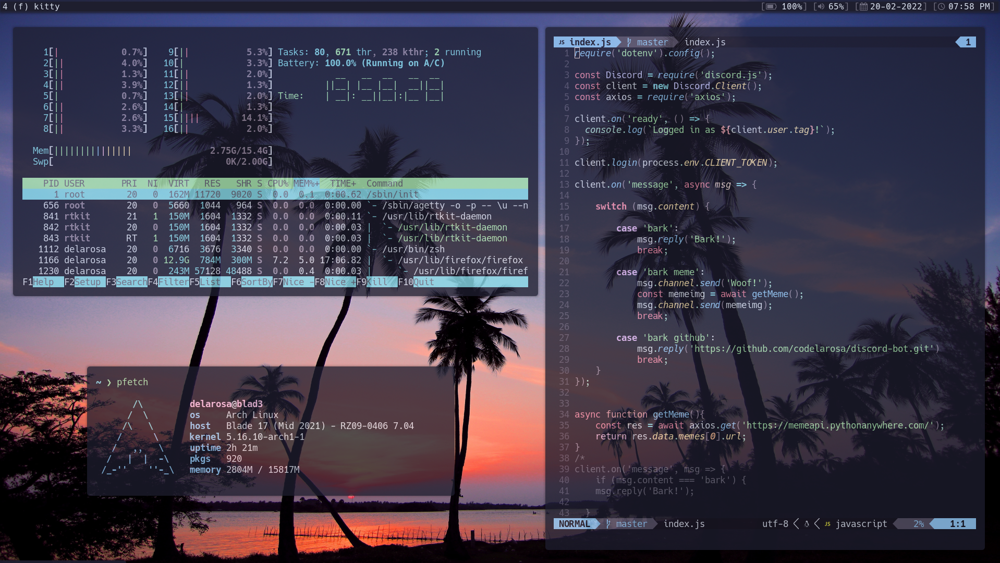

# Delarosa's dotfiles 

# Software
### Operating System
- [X] [Arch Linux](https://archlinux.org/)
- [ ] [Manjaro](https://manjaro.org)
- [ ] [Linux Mint](https://linuxmint.com)
- [ ] [Fedora](https://getfedora.org)

* Operating System: [Arch Linux](https://archlinux.org/)
* Display Manager: [ly](https://github.com/fairyglade/ly)
* Window Manager: [spectrwm](https://github.com/conformal/spectrwm)
* Terminal: [kitty](https://github.com/kovidgoyal/kitty)
* Shell: [zsh](https://www.zsh.org/) + [oh-my-zsh](https://ohmyz.sh/) + [starship](https://starship.rs/)
* Text Editor: [sublime text](https://www.sublimetext.com/) + [obsidian](https://obsidian.md/)
* IDE: [neovim nightly](https://github.com/neovim/neovim/releases)
* Color Scheme: [catppuccin](https://github.com/catppuccin/catppuccin)

# Hardware
* Host: Razer Blade 17" (Mid 2021)
* CPU: 11th Gen Intel i7-11800H @ 4.6GHz
* GPU: NVIDIA GeForce RTX 3070
* Memory: 16GB
