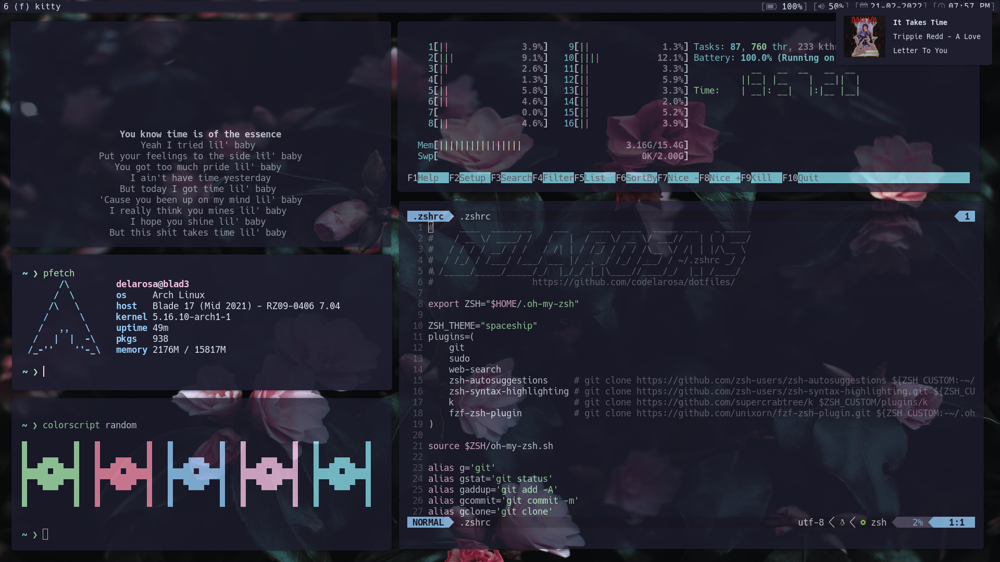

# spectrwm

  
  
  
  
  

---

* **Operating System**: [Arch Linux](https://archlinux.org)
* **Display Manager**: [ly](https://github.com/fairyglade/ly)
* **Window Manager**: [spectrwm](https://github.com/conformal/spectrwm)
* **Compositor**: [Picom](https://github.com/yshui/picom)
* **Terminal**: [kitty](https://github.com/kovidgoyal/kitty)
* **Shell**: [zsh](https://www.zsh.org) + [oh-my-zsh](https://ohmyz.sh) + [starship](https://starship.rs)
* **IDE**: [neovim nightly](https://github.com/neovim/neovim/releases)
* **Text Editor**: [sublime text](https://www.sublimetext.com) + [obsidian](https://obsidian.md)
* **Color Scheme**: [catppuccin](https://github.com/catppuccin/catppuccin)

* **Wallpaper**: [palmtrees.jpg](./assets/wallpapers/palmtrees.jpg)
* **Icons**: [Mist](./assets/icons)
* **Font**: [Hack Nerd Font](https://www.programmingfonts.org/#hack)
